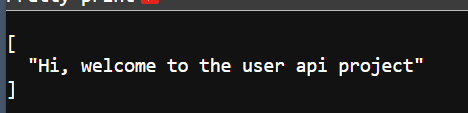
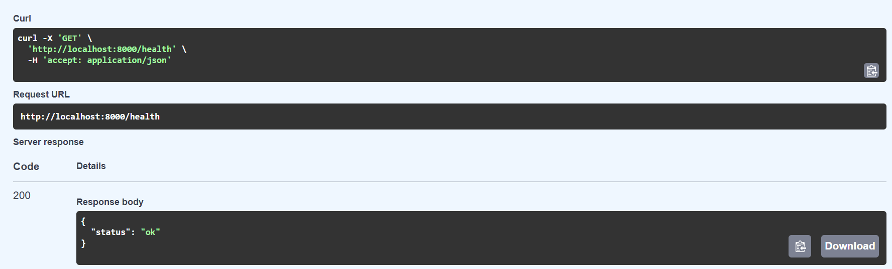
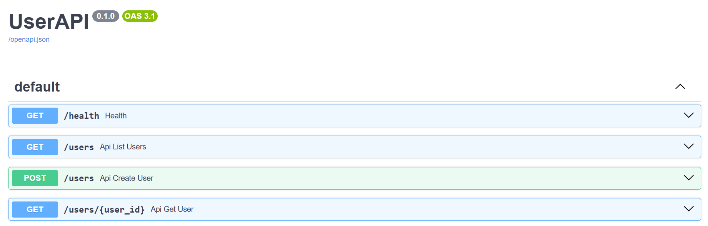
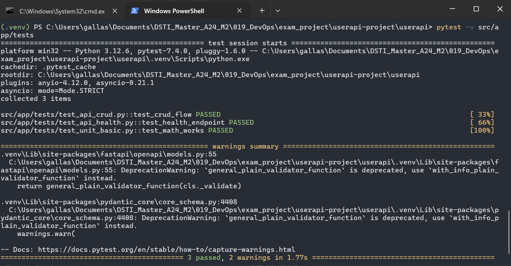

# UserAPI DevOps Project

## 1. Project Overview

The UserAPI project is a complete, end-to-end DevOps solution designed to demonstrate modern software delivery practices, covering application development, automated testing, continuous integration, infrastructure as code, containerization, and Kubernetes orchestration.

The system is built around a simple yet extensible User Management API implemented in Python (FastAPI) and backed by PostgreSQL. The API exposes full CRUD operations and includes a `/health` endpoint for automated validation and monitoring as well as routes documentation with SwaggerUI.

This project implements:
- Continuous Testing  
- Continuous Integration (CI)  
- Infrastructure as Code (IaC) with Vagrant + Ansible  
- Docker image creation and Docker Compose orchestration  
- Kubernetes deployment via Minikube  
- Full project documentation and reproducible deployment steps  

## 2. Description of Tasks Completed

### 2.1 Architecture Overview

This project follows a modular DevOps-oriented structure designed to demonstrate the full CI/CD lifecycle, containerization, orchestration, and infrastructure-as-code practices.

Below is an overview of the final project structure:

``` code
userapi-project
├── .github
│   └── workflows
│       ├── ci.yml
│       └── docker-publish.yml
├── .gitignore
├── docker-compose.yaml
├── iac
│   ├── playbooks
│   │   ├── roles
│   │   │   ├── app
│   │   │   │   └── tasks
│   │   │   │       └── main.yml
│   │   │   ├── db
│   │   │   │   ├── handlers
│   │   │   │   │   └── main.yml
│   │   │   │   └── tasks
│   │   │   │       └── main.yml
│   │   │   ├── health
│   │   │   │   └── tasks
│   │   │   │       └── main.yml
│   │   │   └── python
│   │   │       └── tasks
│   │   │           └── main.yml
│   │   └── site.yml
│   └── Vagrantfile
├── images
├── k8s
│   ├── configmap.yaml
│   ├── namespace.yaml
│   ├── postgres-deployment.yaml
│   ├── postgres-service.yaml
│   ├── secret.yaml
│   ├── userapi-deployment.yaml
│   └── userapi-service.yaml
├── README.md
└── userapi
    └── src
        ├── app
        │   ├── crud.py
        │   ├── db.py
        │   ├── main.py
        │   ├── requirements.txt
        │   ├── schemas.py
        │   ├── tests
        │   │   ├── test_api_crud.py
        │   │   ├── test_api_health.py
        │   │   ├── test_unit_basic.py
        │   │   ├── __init__.py
        │   ├── __init__.py
        └── Dockerfile
```

### 2.2 Detailed Work Description

#### A -  Application Development

- FastAPI CRUD application for user management. 

  

- PostgreSQL database integration using `asyncpg`.
- Includes:
  - health check endpoint

    

  - fully isolated routers
  - database models
  - error handling
- see : `/userapi/src/app` for more details
- As FastAPI comes with Swagger Doc API, navigate to `/docs` after deploying the app to try functions.

    


#### B - Automated Testing
Tests implemented:
- **Unit Tests** – validation logic, utilities
- **API Tests** – endpoints with test client
- **Database Tests** – connection & integration
- see : `/userapi/src/app/tests` 

  


#### -c Continuous Integration (CI)
- GitHub Actions workflow: 
    - app workflow: `.github/workflows/ci.yml`
    - app image workflow: `.github/workflows/docker-publish.yml`
- Automated steps:
  - install dependencies
  - run tests

-- img
  - build Docker image after change
  - push to Docker Hub on `master`

-- img

#### -d Containerization (Docker)
- Dockerfile:
  - light Python base image
  - installs dependencies
  - exposes port 8000
  - starts FastAPI with Uvicorn
  - `.dockerignore` used to reduce image size
--img
  - Image pushed to Docker Hub:
  - `docker.io/gallasng/userapi:latest`
--img

#### -e Infrastructure as Code (Vagrant + Ansible)
  - Vagrant VM: Ubuntu 22.04
  - Ansible provisioning:
  - install Python & PostgreSQL
  - deploy application via sync folder
  - systemd service created
--img
  - health check verification
--img

#### -f Kubernetes Deployment
Resources created:
- namespace: `userapi`
- deployments:
  - **userapi**
  - **postgres**
- services:
  - ClusterIP for postgres
  - NodePort for userapi
--img

- Verified inside Minikube VM
--img

## 3. Instructions to Run the Project
Clone the project
### 3.1 Run Locally (without Docker)
* Make sure to have a running instance of postgres with:
 user = vagrant
 password = password
 db = userdb
 port = 5432
 - orelse you can edit `db.py` with your own existing variables
```bash
cd userapi
python -m venv venv
.venv\Source\activate

cd userapi\src
pip install -r requirements.txt
uvicorn app.main:app --reload
```

API URL:
http://localhost:8000

### 3.2 Run Using Docker Compose
```bash
docker-compose up --build
```
API URL:
http://localhost:8000

### 3.3 Build Image Manually
``` bash
docker build -t userapi /userapi/src/
```
### 3.4 Run with Vagrant + Ansible 
```bash
cd iac
vagrant up .
vagrant ssh
```
You should be able to access the app through the VM using curl and locally at http://localhost:8000/ .
``` bash
curl localhost:8000/health
```
### 3.5 Deploy on Kubernetes (Minikube) 
[Install Minikube](https://kubernetes.io/docs/tasks/tools/install-minikube/) following the instructions depending on your OS.
1. Start your cluster 
```bash
minikube start
```

2. Apply namespace and config
```bash
kubectl apply -f k8s/namespace.yaml
kubectl apply -f k8s/configmap.yaml
```
3. Apply deployments
```bash
kubectl apply -f k8s/postgres-deployment.yaml
kubectl apply -f k8s/userapi-deployment.yaml
```
4. Apply services
```bash
kubectl apply -f k8s/postgres-service.yaml
kubectl apply -f k8s/userapi-service.yaml
```

5. Get NodePort
```bash
kubectl get svc -n userapi
```
Expected output:
userapi   NodePort   ... 8000:30080/TCP

5. Get you minikube Ip
```bash
minikube ip
```
Expected output:
192.168.59.1**

6. Access the app with the forwarding port and your minikube ip :
```bash
http://192.168.59.101:30080/health (replace with your own ip)
```

## 4. Links
Docker Hub Image:
https://hub.docker.com/r/gallasng/userapi

GitHub Repository:
https://github.com/gallas-ng/userapi-project


## 5. Authorship
Project completed by:
 - Falilou NIang - Katy Mayoro Fall
 - @Data ScienceTech Institute
 - Course: DevOps – DSTI
 - Year: 2025

All code, automation scripts, tests, and documentation were developed as part of the academic requirements of the DevOps module.
